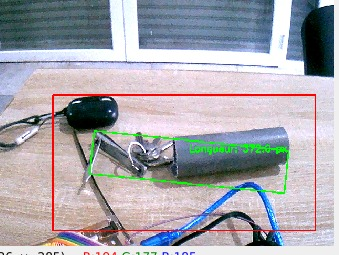
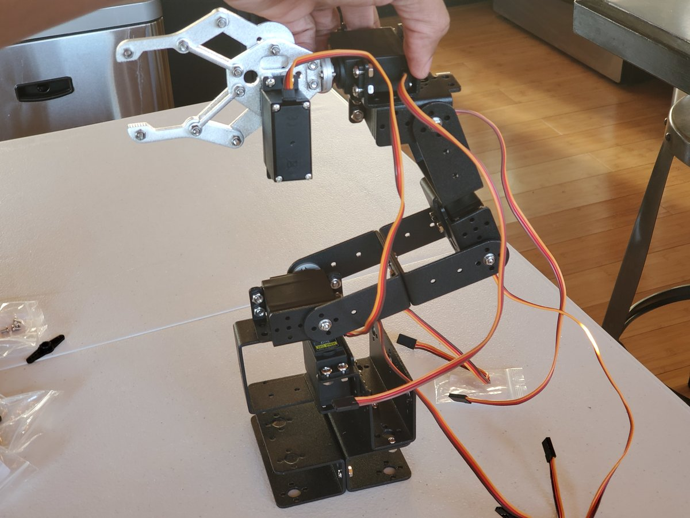

# Pipe Detection with OpenCV and Arduino

This project uses OpenCV to detect pipes in a video stream and sends the length of the detected pipe to an Arduino board via serial communication.

## Requirements

* OpenCV 4.6.0
* Python 3.9
* PySerial 3.5
* Arduino board

## How to use

1. Connect the Arduino board to your computer.
2. Run the script `app.py` with Python.
3. The script will open a window displaying the video stream from the default camera.
4. The script will detect pipes in the video stream and draw a rectangle around the detected pipe.
5. The script will also send the length of the detected pipe to the Arduino board via serial communication.
6. The Arduino board can then use this information to control a robot or any other device.

## How it works

The script uses the following steps to detect pipes:

1. Capture a frame from the video stream.
2. Convert the frame to grayscale.
3. Apply a Gaussian blur to the grayscale image.
4. Apply a threshold to the blurred image to segment out the pipe.
5. Find the contours of the segmented pipe.
6. Iterate over the contours and find the one with the largest area.
7. Calculate the length of the detected pipe.
8. Send the length of the detected pipe to the Arduino board via serial communication.

The script also draws a rectangle around the detected pipe on the video stream.

## Configuration

The script can be configured by modifying the following variables:

* `arduino_port`: the serial port of the Arduino board.
* `baud_rate`: the baud rate of the serial communication.
* `annotation_file`: the file containing the annotations of the pipe.
* `image_width` and `image_height`: the width and height of the video stream.

These variables can be modified in the `app.py` script.

## License

This project is licensed under the MIT License. See the `LICENSE` file for more information.# robotic-arms-Computer-Vision
